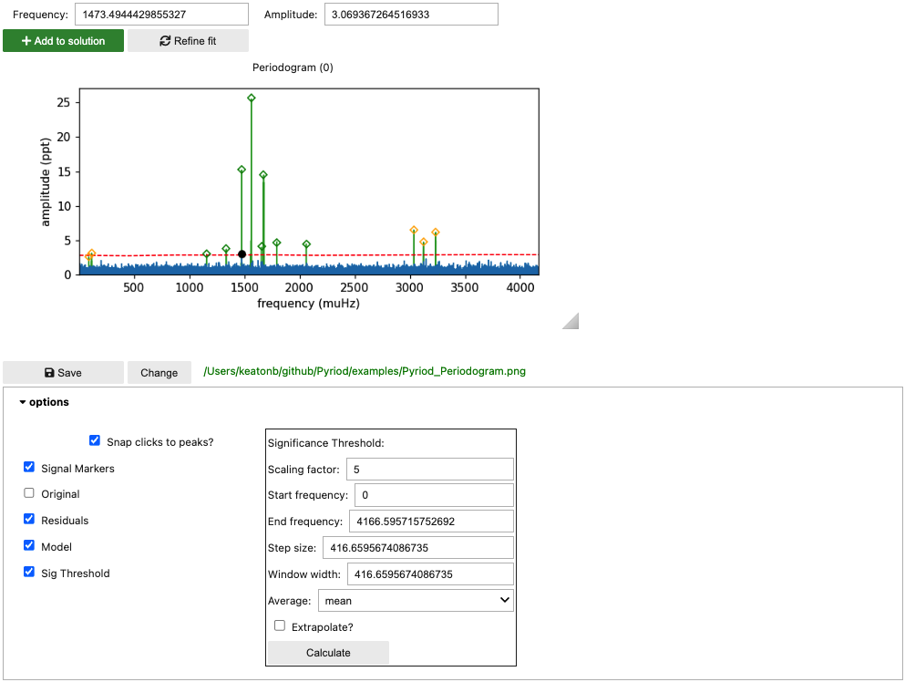
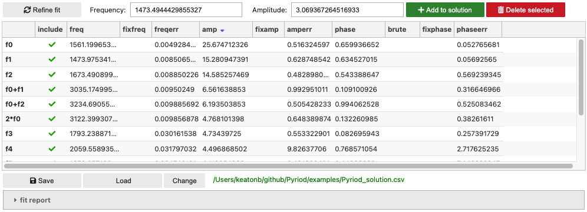
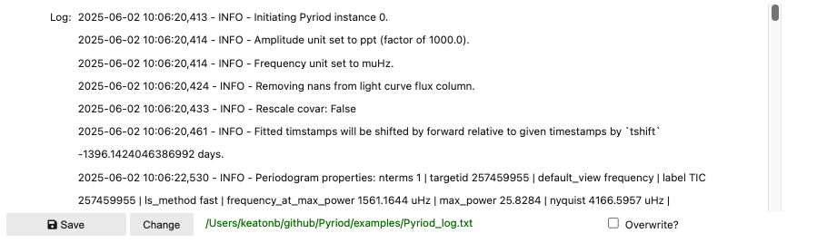

#Walkthrough

Here is a guide to the Pyriod's interactive graphical interface and basic functions. Pyriod is primarily meant to be run interactively in a Jupyter environment.  To display the widgets, you must type the `%matplotlib widget` magic command at the top of your Jupyter notebook.  Then import Pyriod.
````
%matplotlib widget
from Pyriod import Pyriod
````
Time series data must be passed as a lightkurve.LightCurve object when the Pyriod class is instantiated. You can create a [lightkurve.LightCurve](https://lightkurve.github.io/lightkurve/reference/api/lightkurve.LightCurve.html) object from generic time series data.
````
import lightkurve as lk
lc = lk.search_lightcurve('TIC 257459955',mission='TESS',sector=3)[0].download().remove_nans().flatten(2161).remove_outliers(5)

pyriod = Pyriod(lc)
````
The times in the light curve are expected to be given in days. Frequencies can be either in microHertz (default) or 1/day (`freq_unit="1/d"`). The units for providing signal amplitudes can be chosen with `amp_unit=` one of `['relative', 'percent', 'ppt', 'ppm', 'mma']`.

The full Pyriod analysis interface is displayed by running  
````
pyriod.Pyriod()
````
A description of the individual program tabs follows. These can each also be displayed in individual notebook cells.


Note: Pyriod behaves best in a fresh notebook. Previous plotting in the same notebook can unfortunately cause Pyriod to dump extra copies of its plots at initialization. 


## Time Series tab

The Time Series tab can be displayed individually in a notebook cell with
````
pyriod.TimeSeries()
````
Use the toolbar to pan/zoom or save a copy of the figure. As you add signals to your frequency solution, the red curve will update to display the current best-fit model to the time series data. From the options dropdown you can access additional features. Change the graph to show the plot of the original time series or the residuals after subtracting the current model, or fold the time series on a chosen frequency.

Without the pan or zoom tools selected, you can select points you want to exclude from your fit by clicking and dragging a path around then with a lasso selector, and then hitting delete or backspace.  You can restore these points with the "Reset mask" button under options.


## Periodogram tab

Display the periodogram tab content directly by calling
````
pyriod.Periodogram()
````

Initially this displays the periodogram of the original data.  You can click on peaks to stage them for adoption into your frequency solution. Click "Add to solution" to add the currently selected peak to the model.  Then click "Refine fit" to compute a least-squared fit of the model with the new signals to the time series data.  The plot will update to show the periodogram of the residuals (blue), and the periodogram of the model will be displayed in the background (green). You can continue to select peaks from the periodogram of the residuals to add to the frequency solution. The next section includes instructions for how to manually add frequencies, or to specify combination frequencies and harmonics in terms of their base frequencies.

Signals can also be added to the model at numerically specified frequencies. Type a frequency in the "frequency" text box and click "Add to solution". You can also add combination frequencies by typing arithmetic expressions in the "Frequency" field. These should involve the independently labeled signals (`f0, f1, f2...`) such as `2*f0` or `f1+f2`. These arithmetic relationships between frequencies will be enforced in the fitting procedure. 

Expand the options dropdown to choose what to display in the plot, or to calculate a significance threshold. A significance threshold is calculated by computing the average (either mean or median) amplitude across the residuals periodogram in a sliding window of width "window width" moving in steps of "step size" (frequency units). Depending on you data set and problem at hand, you may choose to identify statistically significant signals as those above some "scaling factor" greater than the average local periodogram amplitudes. You may wish to update this threshold throughout the prewhitening process.



## Signals cell

You can display a table of signals in your frequency solution by calling
````
pyriod.Signals()
````
The table provides current best-fit values and uncertainties from the last time "Refine fit" was called, with approximate values included for recently added signals.  The [Qgrid](https://github.com/quantopian/qgrid) table can be sorted and columns rearranged as needed.  You can also edit values as you wish, de-select those signals that you wish to "include" in the solution, or select the values for signal frequencies, amplitudes, or phases that you want to keep fixed during the fitting. The "Delete selected" button will remove all currently selected signals from the model (after next call to "refine fit").

** *Gotcha:* ** Unfortunately, Qgrid tables don't register a change if you click away from the table without first hitting Enter or clicking elsewhere within the table.

The buttons for adding signals to the solution and refining the fit are repeated here for convenience.

You can save the frequency solution to the provided csv filename (relative path), or load one from a previous analysis.

More details of the current model fit to the time series (achieved with [lmfit](https://lmfit.github.io/lmfit-py/)) can be displayed by expanding the "fit report" area.



## Log cell
The Log records important actions taken as part of your analysis for reproducibility and can be saved to plain text.

````
pyriod.Log()
````



